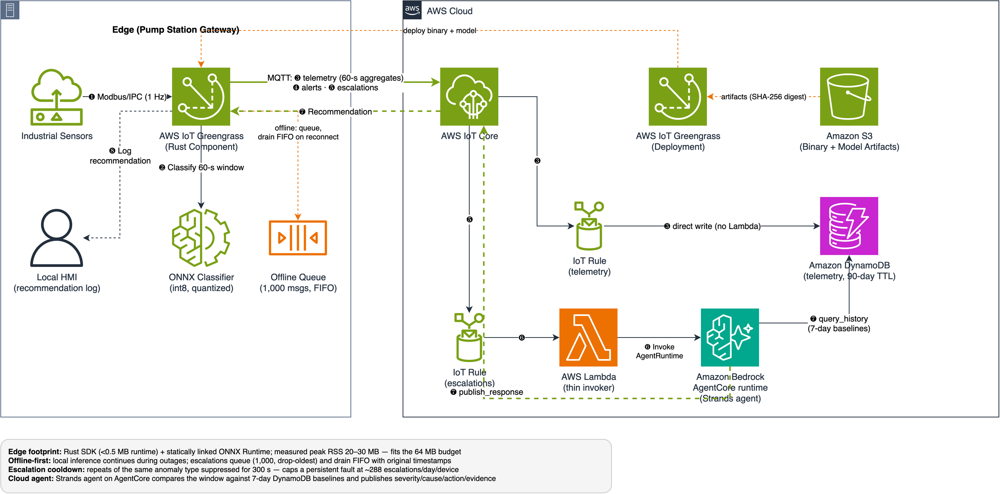

# sample-greengrass-rust-edge-ai-agent

Reference implementation for the AWS blog post **"Build edge AI agents with the AWS IoT Greengrass Component SDK for Rust"**.

A Rust-based AWS IoT Greengrass component runs a quantized ONNX anomaly classification model locally on resource-constrained industrial gateways (ARM Cortex-A53, 256 MB RAM). Simple anomalies are classified at the edge; complex multi-sensor correlations escalate through AWS IoT Core MQTT to a Strands Agents-based agent on Amazon Bedrock AgentCore runtime, which analyzes 7-day historical telemetry from Amazon DynamoDB and returns a maintenance recommendation to the device.

## Documentation: where to start

The docs form an onboarding ladder — each step assumes the one before it. Jump in wherever your background allows:

| Step | Document | What it gives you | Read it when… |
|---|---|---|---|
| Story | [Overview](docs/overview.md) | The whole system in plain language — the pump station, the "two brains," why edge + cloud | You're new to edge AI, IoT, or this project |
| See it | [Interactive explainer](docs/explainer.html) *(open locally in a browser)* | An animated, playable model of the data flow: inject faults, cut the network, watch messages travel edge→cloud→edge | You want to *watch* the story instead of reading it |
| Terms | [Glossary](docs/learning/glossary.md) | Plain-English definitions of every term the docs use (crate, ONNX, quantization, IPC, AgentCore, …) | A word in any doc stops you |
| Rust + setup | [Learning guide](docs/learning/rust-concepts-for-greengrass.md) | Rust installation and verification, language basics, each concept mapped to the real code that uses it | You want to read or modify the Rust component |
| Design | [Architecture](docs/architecture.md) | Language-split rationale, component task model, sync-SDK-to-tokio bridge, ort linking, cloud data flow | You want to know *why* it's built this way |
| Hands-on | [Runbook](docs/runbook.md) | Testing in 3 levels: free local → live AWS → real device, with expected outputs and failure modes | You want to run it |
| Presenting | [Demo script](docs/demo.md) | A rehearsed 4-act demo flow with prep checklist and teardown | You're showing it to an audience |

Reference material behind the ladder: [benchmarks](benchmarks/README.md) (methodology + measured numbers), [Kiro spec v2](docs/kiro-spec-greengrass-rust-edge-ai-v2.md) (the requirements/design/tasks that drove the implementation), and the [blog draft v2](docs/greengrass-rust-edge-ai-agent-aws-v2.md).

## Repository layout

| Path | Contents |
|---|---|
| `edge-component/` | Rust Greengrass component: sliding window, ONNX inference (`ort`), anomaly routing, offline escalation queue, Greengrass IPC/MQTT bridge. Tests run on any host; the device build is Docker cross-compiled. |
| `component-recipe/` | Greengrass recipe (thing-scoped IPC/MQTT permissions, model digest) |
| `model/` | Training + int8 quantization scripts, pre-built `sample_model.onnx` |
| `agent/` | Strands Agents-based agent (system prompt + DynamoDB/IoT tools) packaged for AgentCore runtime |
| `cloud-stack/` | CDK app: IoT Rules, DynamoDB telemetry table, escalation Lambda, AgentCore runtime |
| `simulator/` | Device-side sensor simulator + cloud-side fleet simulator/history seeder |
| `scripts/` | build / deploy_component / deploy_cloud / run_benchmarks / cleanup |
| `benchmarks/` | Methodology and results (NFR-1/NFR-2) |
| `docs/` | All documentation — see [Documentation: where to start](#documentation-where-to-start) above |

## Prerequisites

- Rust 1.89+ (host tests), Docker (device cross-compilation)
- Python 3.12+ with `pip install -r cloud-stack/requirements.txt -r agent/requirements.txt`
- AWS CDK CLI v2, AWS credentials
- A Greengrass v2 core device (aarch64) in a thing group, Nucleus ≥ 2.14 with `interpolateComponentConfiguration` set to `true`
- Amazon Bedrock model access for Claude Haiku 4.5 (`us.anthropic.claude-haiku-4-5-20251001-v1:0`)

## Quick start

```bash
# 1. Run the test suite (no AWS or device needed)
cd edge-component && cargo test && cd ..
python3 -m pytest cloud-stack/tests/ agent/tests/

# 2. Cross-compile the component for aarch64
./scripts/build.sh

# 3. Deploy the cloud stack (DynamoDB, IoT Rules, Lambda, AgentCore runtime agent)
./scripts/deploy_cloud.sh us-east-1

# 4. Seed 7 days of telemetry history so the agent has baselines
python3 simulator/fleet_simulator.py seed --stations 1 --days 7

# 5. Deploy the component to your thing group
./scripts/deploy_component.sh <artifact-bucket> <thing-group> us-east-1

# 6. Exercise the full loop without hardware: fire a synthetic escalation
python3 simulator/fleet_simulator.py escalate --station <thing-name>
# ... then watch pump-stations/<thing-name>/recommendations in the
#     AWS IoT MQTT test client.

# 7. Tear everything down
./scripts/cleanup.sh us-east-1
```

## Cost

Everything is serverless/on-demand: DynamoDB on-demand + 90-day TTL, ARM64
Lambda, AgentCore runtime (pay-per-request), IoT Core messaging. A full
demo run (seed + a few escalations) costs well under $1; the dominant cost
is Bedrock model invocation per escalation. **Run `scripts/cleanup.sh`
after testing.**

## Architecture



Full design notes in [docs/architecture.md](docs/architecture.md).

## Security

- No network listeners and no component-held credentials on the device —
  MQTT goes through the Greengrass Nucleus (IPC MQTT proxy), topics and IPC
  permissions scoped to `{iot:thingName}`.
- Model integrity: S3 artifact digest at deployment + SHA-256 re-check at
  startup.
- Agent IAM: read-only telemetry access; `iot:Publish` limited to
  recommendation topics; Bedrock invoke limited to the configured model.

## License

This library is licensed under the MIT-0 License. See the LICENSE file.
