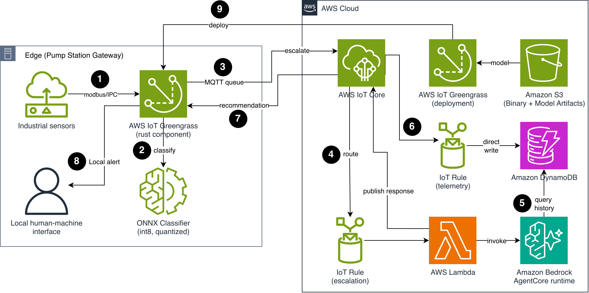

# Build edge AI agents with the AWS IoT Greengrass Component SDK for Rust

## Overview

The AWS IoT Greengrass Component SDK for Rust enables edge AI agents on resource-constrained devices to classify sensor anomalies locally and escalate complex reasoning to the cloud. The Rust SDK provides a runtime footprint under 0.5 MB, making it well suited to devices with tight memory budgets (under 256 MB RAM). Combined with a purpose-built ONNX classification model running locally, Rust-based AWS IoT Greengrass components deliver AI inference at the edge while leaving the majority of device memory free for other processes.

This repository contains the reference implementation for a Rust-based AWS IoT Greengrass component that runs a quantized ONNX anomaly classification model for local sensor data analysis on industrial gateways. When the local model identifies a complex anomaly requiring deeper analysis, the component escalates to a cloud-based agent running on Amazon Bedrock AgentCore through AWS IoT Core MQTT messaging. This edge-to-cloud pattern keeps latency-sensitive decisions local while routing complex reasoning to the cloud.

## Use case

A water utility operates 2,000 remote pump stations across a rural distribution network. Each station has a microcontroller-class gateway (ARM Cortex-A53, 256 MB RAM, intermittent cellular connectivity) monitoring flow rate, pressure, vibration, and temperature sensors.

The utility needs to:

- Classify sensor anomalies locally within 200 ms (faster than a round-trip to the cloud)
- Operate during network outages (cellular connectivity drops for hours during storms)
- Escalate complex multi-sensor correlations to a cloud agent for root cause analysis and work order generation
- Keep per-gateway memory usage under 64 MB for the AI component (other processes share the 256 MB)

With a sub-0.5 MB footprint, the Rust SDK is well suited to these devices, leaving most of the memory budget available for the classification model and inference logic.

## Architecture

The following diagram shows the edge-to-cloud AI pattern with the Rust Greengrass component.



The architecture spans two zones: the edge pump station gateway and the AWS Cloud. The edge gateway hosts the Rust Greengrass component and the ONNX classifier. The cloud hosts AWS IoT Core, IoT rules, AWS Lambda, Amazon Bedrock AgentCore runtime, and Amazon DynamoDB for historical telemetry storage. Amazon Simple Storage Service (Amazon S3) stores the binary and model artifacts for fleet deployment.

The following walkthrough describes the data flow through the architecture:

1. Industrial sensors publish readings through Modbus to the gateway. The Rust Greengrass component receives them through local inter-process communication (IPC) at 1-second intervals.
2. The Rust Greengrass component runs each full 60-second sensor window through the quantized ONNX classifier and produces a confidence-scored anomaly classification. The repository ships a sample model (approximately 25,000 parameters, approximately 23 KB) for testing.
3. The component publishes telemetry, alerts, and escalation messages to AWS IoT Core through an MQTT queue. During network outages, messages queue locally (1,000 messages, FIFO) and drain on reconnect.
4. AWS IoT Core routes messages to two IoT rules. The escalation rule forwards complex anomalies to an AWS Lambda function, which invokes a Strands Agents-based agent on AgentCore runtime.
5. The agent queries Amazon DynamoDB for 7-day historical sensor baselines at that station to inform its root cause analysis.
6. The telemetry IoT rule performs a direct write of sensor data to Amazon DynamoDB (90-day time to live) for historical storage. No Lambda function is required on this path.
7. The agent publishes a recommendation (severity, probable cause, recommended action) back to the Rust component through AWS IoT Core MQTT.
8. The Rust component displays the recommendation as a local alert on the Human-Machine Interface (HMI).
9. AWS IoT Greengrass pulls binary and model artifacts from Amazon S3 and deploys them to the edge device during fleet deployments.

## Choosing between the Python SDK and Rust SDK

AWS IoT Greengrass supports component development in multiple languages. For AI workloads on constrained devices (under 256 MB RAM), the minimal footprint of the Rust Component SDK leaves more memory available for the model and inference runtime. For devices with more available memory, the Python path provides faster development iteration and access to the broader set of Python ML libraries.

The following table summarizes the characteristics relevant to constrained-device AI workloads. Values are based on testing with the sample workload in this repository. See the `benchmarks/` directory for reproduction steps.

| Characteristic | Python SDK | Rust SDK |
|---|---|---|
| Runtime memory footprint | Approximately 30 MB | Less than 0.5 MB |
| Cold start time | 2-5 seconds (typical) | Less than 100 ms (typical) |
| ONNX inference integration | Using onnxruntime-python (additional 30+ MB) | Using ort crate (statically linked, included in 22 MB binary) |
| Concurrency model | Thread-based (GIL-constrained) | Async tasks (tokio) |
| Binary size (stripped) | N/A (interpreted) | Approximately 22 MB (ONNX Runtime static link dominates) |
| Total footprint (runtime + model + inference) | 70-110 MB (estimated) | 22 MB peak RSS measured with sample model; up to 35 MB projected with 12 MB production model |

For the pump station use case (64 MB budget for the AI component), the Rust SDK is the appropriate choice. For devices with 1+ GB RAM where development speed is prioritized, the Python SDK remains the faster path to production.

## Edge component design

The Rust component uses three logical tasks running concurrently using tokio (Rust's asynchronous runtime):

- **Ingestion and inference task:** Subscribes to local IPC topics using the `aws-greengrass-component-sdk` crate and buffers sensor readings in a sliding window (60 seconds). Classifies every full window using the `ort` crate (Rust bindings for ONNX Runtime) and returns confidence-scored anomaly types (normal, single-sensor fault, multi-sensor correlation, unknown). Because readings arrive at 1 Hz and inference completes in under 50 ms, ingestion and inference run sequentially in the same task.
- **Communication task:** Publishes classified alerts locally or escalates to the cloud through MQTT. Handles offline queuing with a bounded FIFO queue (1,000 messages, drop-oldest on overflow) for periods without connectivity.
- **Response task:** Subscribes to the cloud recommendation topic and appends received recommendations to a local log file for HMI display.

The AWS IoT Greengrass Rust SDK provides synchronous C bindings via FFI. The component bridges these to tokio's async runtime using channels, so IPC subscription callbacks feed the async ingestion loop without blocking.

## Model selection for edge

For structured sensor data classification (time series anomaly detection across four sensor channels), a purpose-built ONNX model is more appropriate than a general-purpose language model. The repository ships a sample model for testing:

- **Input:** 60-second sliding window of four sensor channels (240 data points, channel-major layout)
- **Output:** Four classes with softmax confidence (normal, single_sensor_fault, multi_sensor_correlation, unknown)
- **Architecture:** 1D convolutional neural network (CNN) with Squeeze-and-Excitation channel attention
- **Sample model:** Approximately 25,000 parameters, approximately 23 KB (sufficient for demonstration)
- **Inference latency:** Less than 50 ms on ARM Cortex-A53 (see `benchmarks/` for reproduction steps)

For production workloads with more complex classification requirements, scale the model architecture. A 10 million-parameter model at int8 quantization produces approximately 12 MB, which fits well within the 64 MB memory budget.

## Cloud agent design

The Strands Agents-based agent on Amazon Bedrock AgentCore runtime uses two tools:

| Tool | Purpose |
|---|---|
| `query_history` | Query Amazon DynamoDB for 7-day sensor baselines at the specified station and compute statistics (mean, standard deviation, trend) |
| `publish_response` | Publish the recommendation back to the device through AWS IoT Core MQTT |

The agent receives escalation messages containing:

- Sensor readings (60-second window)
- Local model's preliminary classification and confidence score
- Device metadata (pump station ID, installation date, last maintenance)

The agent queries Amazon DynamoDB for historical sensor patterns at that station and reasons about the root cause. It generates a structured response containing severity level, probable cause, recommended action, and supporting evidence from the historical data.

## Key design decisions

- **Escalation cooldown:** Repeats of the same anomaly type are suppressed for 300 seconds per device. Without the cooldown, a stuck sensor generating one reading per second produces 86,400 daily escalations. With 300-second suppression, this reduces to approximately 288.
- **Security:** The Rust binary communicates with the AWS IoT Greengrass nucleus through local IPC (Unix domain sockets), not network sockets. The ONNX model file is integrity-checked at two stages: AWS IoT Greengrass verifies the S3 artifact digest at deployment time, and the component re-verifies the SHA-256 hash at startup before loading the model into memory.
- **Cross-compilation:** The repository includes a multi-stage Dockerfile that cross-compiles the Rust binary with statically linked ONNX Runtime for aarch64-unknown-linux-gnu. This produces a self-contained binary with minimal runtime dependencies on the target device (glibc 2.38+, libstdc++, libgcc_s).
- **Nucleus choice:** This solution uses the standard AWS IoT Greengrass nucleus rather than Nucleus Lite. Although the Rust SDK runtime footprint (under 0.5 MB) fits within Nucleus Lite's 5 MB workload limit, the statically linked ONNX Runtime brings the total binary to approximately 22 MB, which exceeds that ceiling.

## Prerequisites

- An AWS account with AWS Cloud Development Kit (AWS CDK) bootstrapped in the target Region
- AWS IoT Greengrass core device (ARM64 Linux) with AWS IoT Greengrass nucleus 2.14 or later with `interpolateComponentConfiguration` set to `true`
- Rust toolchain (1.89 or later) with aarch64-unknown-linux-gnu cross-compilation target
- Docker (for cross-compilation build environment)
- Python 3.12 or later with `pip install -r cloud-stack/requirements.txt -r agent/requirements.txt`
- AWS IoT Core configured with the Greengrass core device registered
- Amazon Bedrock model access for Anthropic Claude Haiku 4.5 (`us.anthropic.claude-haiku-4-5-20251001-v1:0`)

## Deploying

The deployment consists of two parts: the edge component deployed to your device fleet and the cloud stack deployed to your AWS account.

### To deploy the edge component

1. Cross-compile the Rust component for ARM64 using the provided Dockerfile:

```bash
docker build \
  -f edge-component/Dockerfile \
  -t edge-ai-classifier-build \
  --target output \
  --output "type=local,dest=edge-component/dist" \
  edge-component/
```

2. The component recipe defines the lifecycle and artifact dependencies. The following excerpt shows the key sections:

```yaml
RecipeFormatVersion: "2020-01-25"
ComponentName: com.example.EdgeAIClassifier
ComponentVersion: "1.0.1"
Manifests:
  - Platform:
      os: linux
      architecture: aarch64
    Artifacts:
      - URI: s3://BUCKET/artifacts/edge-ai-classifier
      - URI: s3://BUCKET/artifacts/sample_model.onnx
    Lifecycle:
      run:
        script: >-
          {artifacts:path}/edge-ai-classifier
          --model-path {artifacts:path}/sample_model.onnx
          --thing-name {iot:thingName}
```

3. Create an AWS IoT Greengrass deployment targeting your device group:

```bash
aws greengrassv2 create-deployment \
  --target-arn arn:aws:iot:us-east-1:ACCOUNT:thinggroup/PumpStations \
  --components '{"com.example.EdgeAIClassifier": {"componentVersion": "1.0.1"}}'
```

4. Run the fleet simulator to seed synthetic sensor data for testing:

```bash
python3 simulator/fleet_simulator.py seed --stations 10 --days 7
```

### To deploy the cloud stack

1. Deploy the AWS CDK stack:

```bash
cdk deploy --app "python3 cloud-stack/app.py"
```

2. Note the CDK stack outputs (MQTT topics and IoT rule configuration).

## To test with simulated fleet

The repository includes a fleet simulator that populates telemetry history and triggers escalation scenarios without real hardware:

```bash
# Seed 7 days of telemetry history so the agent has baselines
python3 simulator/fleet_simulator.py seed --stations 10 --days 7

# Fire a synthetic escalation (multi-sensor correlation, 55% confidence)
python3 simulator/fleet_simulator.py escalate --station pump-station-001
```

Watch the response on `pump-stations/pump-station-001/recommendations` in the AWS IoT MQTT test client.

Expected behavior for the escalation scenario:

1. The escalation arrives at the IoT Rule, which invokes the escalation Lambda.
2. The Lambda forwards the payload to the AgentCore runtime agent.
3. The agent calls `query_history("pump-station-001", 168)` to retrieve 7-day baseline statistics.
4. The agent reasons over the sensor window against the baseline and classifies root cause.
5. The agent calls `publish_response` with severity, probable cause, recommended action, and evidence.
6. The recommendation arrives at the device on the recommendations topic.

## Clean up

To avoid ongoing charges, stop any running simulators first. Each escalation invokes Amazon Bedrock and accrues cost.

Delete the deployed resources:

```bash
./scripts/cleanup.sh us-east-1
```

This removes the CloudFormation stack (DynamoDB table, IoT Rules, Lambda, AgentCore runtime), the Greengrass deployment, and the S3 artifacts. The Amazon DynamoDB telemetry table uses a time to live (TTL) policy. Data older than 90 days is deleted automatically.

## Run tests

```bash
# Rust unit and integration tests (no AWS or device needed)
cd edge-component && cargo test && cd ..

# Python unit tests (mocked AWS services)
python3 -m pytest cloud-stack/tests/ agent/tests/
```

## Project structure

```
sample-greengrass-rust-edge-ai-agent/
├── edge-component/           # Rust Greengrass component
│   ├── Cargo.toml            # Dependencies: ort, tokio, sha2, serde
│   ├── src/
│   │   ├── main.rs           # Entry point, tokio runtime, config
│   │   ├── ingestion/        # Sliding window, IPC subscriber
│   │   ├── inference/        # ONNX classifier, anomaly types, model loader
│   │   ├── communication/    # MQTT transport, offline queue
│   │   └── orchestrator.rs   # Message routing and task coordination
│   ├── tests/                # Host-runnable integration tests
│   └── benches/              # Criterion benchmarks
├── component-recipe/         # Greengrass recipe (IPC/MQTT permissions, model digest)
├── model/                    # Training + int8 quantization scripts, pre-built ONNX model
├── agent/                    # Strands Agents agent for AgentCore runtime
│   ├── agent.py              # Agent config, system prompt, entrypoint
│   ├── tools/                # query_history, publish_response
│   ├── Dockerfile            # ARM64 container for AgentCore
│   └── tests/                # Mocked tool tests
├── cloud-stack/              # CDK app (DynamoDB, IoT Rules, Lambda, AgentCore)
│   ├── app.py                # CDK entry point
│   ├── stacks/               # Stack definition
│   ├── lambda/               # Escalation invoker Lambda
│   └── tests/                # CDK assertion tests
├── simulator/                # Fleet simulator (seed, publish, escalate)
├── scripts/                  # build, deploy_component, deploy_cloud, cleanup
├── benchmarks/               # Methodology and measured results
├── docs/                     # Architecture, runbook, demo script
└── LICENSE                   # MIT-0
```


## License

This library is licensed under the MIT-0 License. See the LICENSE file.
